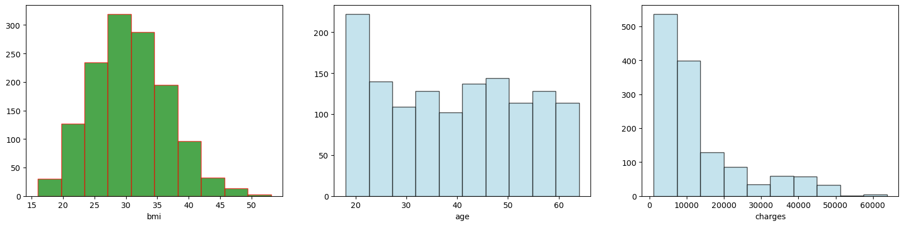
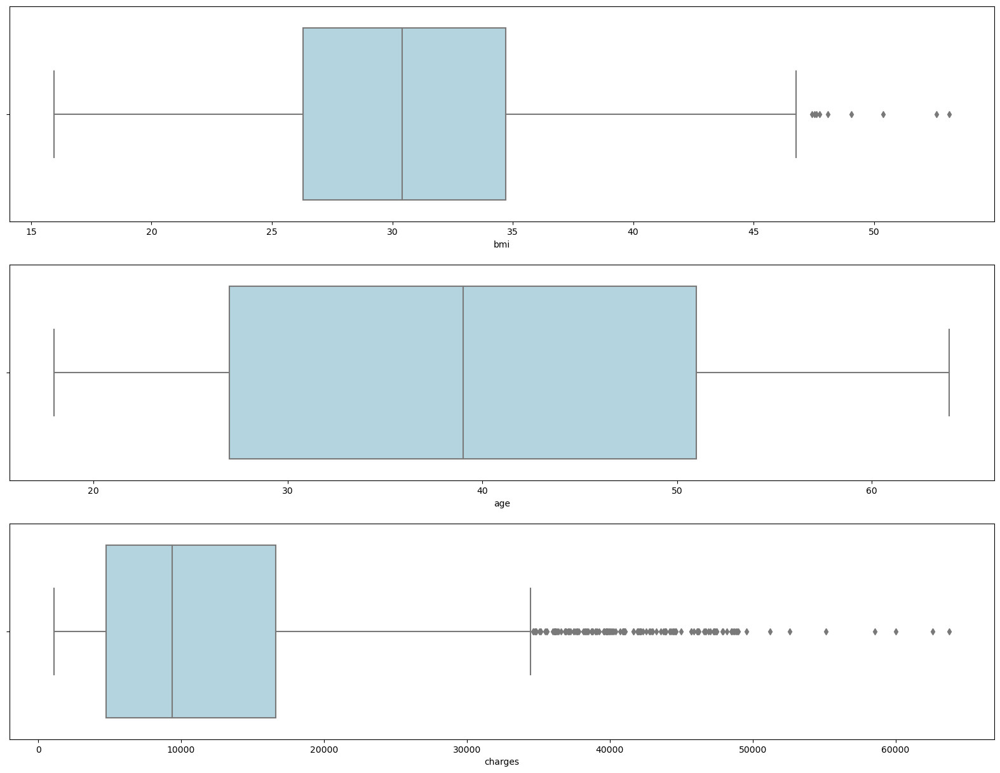
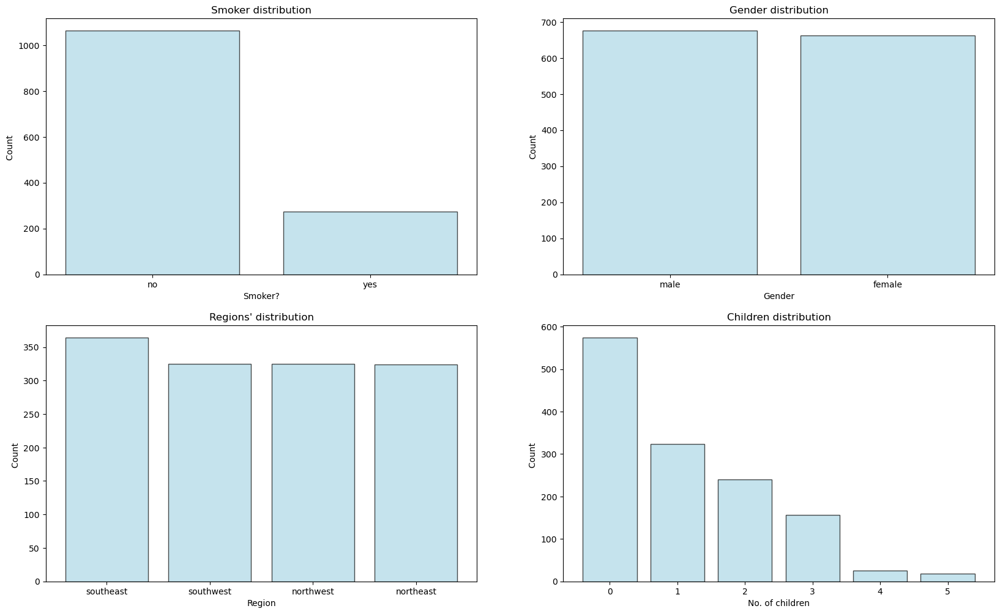
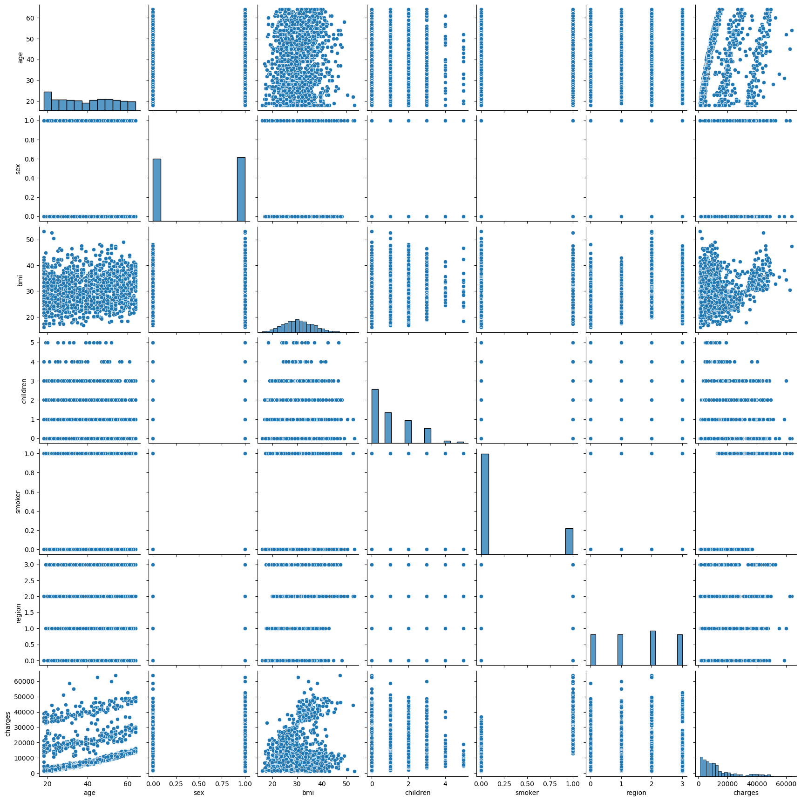
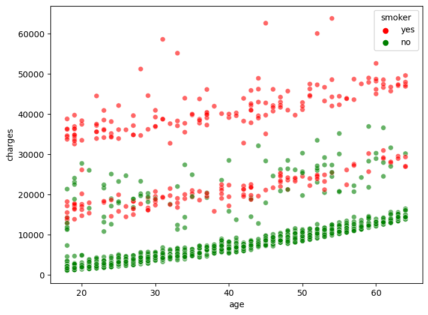
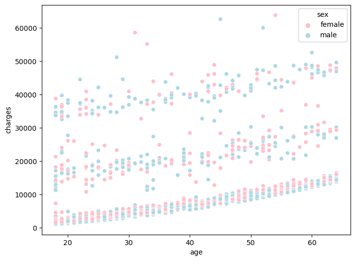

# Statistics-and-Probablity-project


```python
%matplotlib inline
```


```python
import numpy as np
import pandas as pd
from matplotlib import pyplot as plt
import seaborn as sns
import statsmodels.api as sm
import scipy.stats as stats

import copy
```


```python
# sns.set() #setting the default seaborn style for our plots
```


```python
df = pd.read_csv('insurance.csv') # read the data as a data frame
```


```python
df.head()  #checking the head of the data frame
```


<div>
<style scoped>
    .dataframe tbody tr th:only-of-type {
        vertical-align: middle;
    }

    .dataframe tbody tr th {
        vertical-align: top;
    }

    .dataframe thead th {
        text-align: right;
    }
</style>
<table border="1" class="dataframe">
  <thead>
    <tr style="text-align: right;">
      <th></th>
      <th>age</th>
      <th>sex</th>
      <th>bmi</th>
      <th>children</th>
      <th>smoker</th>
      <th>region</th>
      <th>charges</th>
    </tr>
  </thead>
  <tbody>
    <tr>
      <th>0</th>
      <td>19</td>
      <td>female</td>
      <td>27.900</td>
      <td>0</td>
      <td>yes</td>
      <td>southwest</td>
      <td>16884.92400</td>
    </tr>
    <tr>
      <th>1</th>
      <td>18</td>
      <td>male</td>
      <td>33.770</td>
      <td>1</td>
      <td>no</td>
      <td>southeast</td>
      <td>1725.55230</td>
    </tr>
    <tr>
      <th>2</th>
      <td>28</td>
      <td>male</td>
      <td>33.000</td>
      <td>3</td>
      <td>no</td>
      <td>southeast</td>
      <td>4449.46200</td>
    </tr>
    <tr>
      <th>3</th>
      <td>33</td>
      <td>male</td>
      <td>22.705</td>
      <td>0</td>
      <td>no</td>
      <td>northwest</td>
      <td>21984.47061</td>
    </tr>
    <tr>
      <th>4</th>
      <td>32</td>
      <td>male</td>
      <td>28.880</td>
      <td>0</td>
      <td>no</td>
      <td>northwest</td>
      <td>3866.85520</td>
    </tr>
  </tbody>
</table>
</div>


```python
df.shape
```


    (1338, 7)


```python
df.info()  #info about the data
```

    <class 'pandas.core.frame.DataFrame'>
    RangeIndex: 1338 entries, 0 to 1337
    Data columns (total 7 columns):
     #   Column    Non-Null Count  Dtype  
    ---  ------    --------------  -----  
     0   age       1338 non-null   int64  
     1   sex       1338 non-null   object 
     2   bmi       1338 non-null   float64
     3   children  1338 non-null   int64  
     4   smoker    1338 non-null   object 
     5   region    1338 non-null   object 
     6   charges   1338 non-null   float64
    dtypes: float64(2), int64(2), object(3)
    memory usage: 73.3+ KB
    

### **checking for missing values**


```python
df.isna().apply(pd.value_counts)   #null value check
```


<div>
<style scoped>
    .dataframe tbody tr th:only-of-type {
        vertical-align: middle;
    }

    .dataframe tbody tr th {
        vertical-align: top;
    }

    .dataframe thead th {
        text-align: right;
    }
</style>
<table border="1" class="dataframe">
  <thead>
    <tr style="text-align: right;">
      <th></th>
      <th>age</th>
      <th>sex</th>
      <th>bmi</th>
      <th>children</th>
      <th>smoker</th>
      <th>region</th>
      <th>charges</th>
    </tr>
  </thead>
  <tbody>
    <tr>
      <th>False</th>
      <td>1338</td>
      <td>1338</td>
      <td>1338</td>
      <td>1338</td>
      <td>1338</td>
      <td>1338</td>
      <td>1338</td>
    </tr>
  </tbody>
</table>
</div>


```python
df.isna().any().sum()
```


    0


```python
df.describe().T   # five point summary of the continuous attributes
```


<div>
<style scoped>
    .dataframe tbody tr th:only-of-type {
        vertical-align: middle;
    }

    .dataframe tbody tr th {
        vertical-align: top;
    }

    .dataframe thead th {
        text-align: right;
    }
</style>
<table border="1" class="dataframe">
  <thead>
    <tr style="text-align: right;">
      <th></th>
      <th>count</th>
      <th>mean</th>
      <th>std</th>
      <th>min</th>
      <th>25%</th>
      <th>50%</th>
      <th>75%</th>
      <th>max</th>
    </tr>
  </thead>
  <tbody>
    <tr>
      <th>age</th>
      <td>1338.0</td>
      <td>39.207025</td>
      <td>14.049960</td>
      <td>18.0000</td>
      <td>27.00000</td>
      <td>39.000</td>
      <td>51.000000</td>
      <td>64.00000</td>
    </tr>
    <tr>
      <th>bmi</th>
      <td>1338.0</td>
      <td>30.663397</td>
      <td>6.098187</td>
      <td>15.9600</td>
      <td>26.29625</td>
      <td>30.400</td>
      <td>34.693750</td>
      <td>53.13000</td>
    </tr>
    <tr>
      <th>children</th>
      <td>1338.0</td>
      <td>1.094918</td>
      <td>1.205493</td>
      <td>0.0000</td>
      <td>0.00000</td>
      <td>1.000</td>
      <td>2.000000</td>
      <td>5.00000</td>
    </tr>
    <tr>
      <th>charges</th>
      <td>1338.0</td>
      <td>13270.422265</td>
      <td>12110.011237</td>
      <td>1121.8739</td>
      <td>4740.28715</td>
      <td>9382.033</td>
      <td>16639.912515</td>
      <td>63770.42801</td>
    </tr>
  </tbody>
</table>
</div>


```python

#Plots to see the distribution of the continuous features individually

plt.figure(figsize= (20,15))
plt.subplot(3,3,1)
plt.hist(df.bmi, color='green', edgecolor = 'red', alpha = 0.7)
plt.xlabel('bmi')

plt.subplot(3,3,2)
plt.hist(df.age, color='lightblue', edgecolor = 'black', alpha = 0.7)
plt.xlabel('age')

plt.subplot(3,3,3)
plt.hist(df.charges, color='lightblue', edgecolor = 'black', alpha = 0.7)
plt.xlabel('charges')

plt.show()
```


    

    


### **Measure of skewness of ‘bmi’, ‘age’ and ‘charges’ columns**


```python
Skewness = pd.DataFrame({'Skewness' : [stats.skew(df.bmi),stats.skew(df.age),stats.skew(df.charges)]},
                        index=['bmi','age','charges'])  # Measure the skeweness of the required columns
Skewness
```


<div>
<style scoped>
    .dataframe tbody tr th:only-of-type {
        vertical-align: middle;
    }

    .dataframe tbody tr th {
        vertical-align: top;
    }

    .dataframe thead th {
        text-align: right;
    }
</style>
<table border="1" class="dataframe">
  <thead>
    <tr style="text-align: right;">
      <th></th>
      <th>Skewness</th>
    </tr>
  </thead>
  <tbody>
    <tr>
      <th>bmi</th>
      <td>0.283729</td>
    </tr>
    <tr>
      <th>age</th>
      <td>0.055610</td>
    </tr>
    <tr>
      <th>charges</th>
      <td>1.514180</td>
    </tr>
  </tbody>
</table>
</div>


### **Checking the presence of outliers in ‘bmi’, ‘age’ and ‘charges columns**


```python
plt.figure(figsize= (20,15))
plt.subplot(3,1,1)
sns.boxplot(x= df.bmi, color='lightblue')

plt.subplot(3,1,2)
sns.boxplot(x= df.age, color='lightblue')

plt.subplot(3,1,3)
sns.boxplot(x= df.charges, color='lightblue')

plt.show()
```


    

    


### **Distribution of categorical columns (include children)**


```python
df.smoker.value_counts()
```


    no     1064
    yes     274
    Name: smoker, dtype: int64


```python
plt.figure(figsize=(20,25))


x = df.smoker.value_counts().index    #Values for x-axis
y = [df['smoker'].value_counts()[i] for i in x]   # Count of each class on y-axis

plt.subplot(4,2,1)
plt.bar(x,y, align='center',color = 'lightblue',edgecolor = 'black',alpha = 0.7)  #plot a bar chart
plt.xlabel('Smoker?')
plt.ylabel('Count ')
plt.title('Smoker distribution')

x1 = df.sex.value_counts().index    #Values for x-axis
y1 = [df['sex'].value_counts()[j] for j in x1]   # Count of each class on y-axis

plt.subplot(4,2,2)
plt.bar(x1,y1, align='center',color = 'lightblue',edgecolor = 'black',alpha = 0.7)  #plot a bar chart
plt.xlabel('Gender')
plt.ylabel('Count')
plt.title('Gender distribution')

x2 = df.region.value_counts().index    #Values for x-axis
y2 = [df['region'].value_counts()[k] for k in x2]   # Count of each class on y-axis

plt.subplot(4,2,3)
plt.bar(x2,y2, align='center',color = 'lightblue',edgecolor = 'black',alpha = 0.7)  #plot a bar chart
plt.xlabel('Region')
plt.ylabel('Count ')
plt.title("Regions' distribution")

x3 = df.children.value_counts().index    #Values for x-axis
y3 = [df['children'].value_counts()[l] for l in x3]   # Count of each class on y-axis

plt.subplot(4,2,4)
plt.bar(x3,y3, align='center',color = 'lightblue',edgecolor = 'black',alpha = 0.7)  #plot a bar chart
plt.xlabel('No. of children')
plt.ylabel('Count ')
plt.title("Children distribution")

plt.show()

```


    

    


### **Pair plot that includes all the columns of the data frame**


```python
#Label encoding the variables before doing a pairplot because pairplot ignores strings

from sklearn.preprocessing import LabelEncoder

df_encoded = copy.deepcopy(df)
df_encoded.loc[:,['sex', 'smoker','region']] = df_encoded.loc[:,['sex', 'smoker', 'region']].apply(LabelEncoder().fit_transform) 

sns.pairplot(df_encoded)  #pairplot
plt.show()
```


    

    


```python
df
```


<div>
<style scoped>
    .dataframe tbody tr th:only-of-type {
        vertical-align: middle;
    }

    .dataframe tbody tr th {
        vertical-align: top;
    }

    .dataframe thead th {
        text-align: right;
    }
</style>
<table border="1" class="dataframe">
  <thead>
    <tr style="text-align: right;">
      <th></th>
      <th>age</th>
      <th>sex</th>
      <th>bmi</th>
      <th>children</th>
      <th>smoker</th>
      <th>region</th>
      <th>charges</th>
    </tr>
  </thead>
  <tbody>
    <tr>
      <th>0</th>
      <td>19</td>
      <td>female</td>
      <td>27.900</td>
      <td>0</td>
      <td>yes</td>
      <td>southwest</td>
      <td>16884.92400</td>
    </tr>
    <tr>
      <th>1</th>
      <td>18</td>
      <td>male</td>
      <td>33.770</td>
      <td>1</td>
      <td>no</td>
      <td>southeast</td>
      <td>1725.55230</td>
    </tr>
    <tr>
      <th>2</th>
      <td>28</td>
      <td>male</td>
      <td>33.000</td>
      <td>3</td>
      <td>no</td>
      <td>southeast</td>
      <td>4449.46200</td>
    </tr>
    <tr>
      <th>3</th>
      <td>33</td>
      <td>male</td>
      <td>22.705</td>
      <td>0</td>
      <td>no</td>
      <td>northwest</td>
      <td>21984.47061</td>
    </tr>
    <tr>
      <th>4</th>
      <td>32</td>
      <td>male</td>
      <td>28.880</td>
      <td>0</td>
      <td>no</td>
      <td>northwest</td>
      <td>3866.85520</td>
    </tr>
    <tr>
      <th>...</th>
      <td>...</td>
      <td>...</td>
      <td>...</td>
      <td>...</td>
      <td>...</td>
      <td>...</td>
      <td>...</td>
    </tr>
    <tr>
      <th>1333</th>
      <td>50</td>
      <td>male</td>
      <td>30.970</td>
      <td>3</td>
      <td>no</td>
      <td>northwest</td>
      <td>10600.54830</td>
    </tr>
    <tr>
      <th>1334</th>
      <td>18</td>
      <td>female</td>
      <td>31.920</td>
      <td>0</td>
      <td>no</td>
      <td>northeast</td>
      <td>2205.98080</td>
    </tr>
    <tr>
      <th>1335</th>
      <td>18</td>
      <td>female</td>
      <td>36.850</td>
      <td>0</td>
      <td>no</td>
      <td>southeast</td>
      <td>1629.83350</td>
    </tr>
    <tr>
      <th>1336</th>
      <td>21</td>
      <td>female</td>
      <td>25.800</td>
      <td>0</td>
      <td>no</td>
      <td>southwest</td>
      <td>2007.94500</td>
    </tr>
    <tr>
      <th>1337</th>
      <td>61</td>
      <td>female</td>
      <td>29.070</td>
      <td>0</td>
      <td>yes</td>
      <td>northwest</td>
      <td>29141.36030</td>
    </tr>
  </tbody>
</table>
<p>1338 rows × 7 columns</p>
</div>


```python
df_encoded
```


<div>
<style scoped>
    .dataframe tbody tr th:only-of-type {
        vertical-align: middle;
    }

    .dataframe tbody tr th {
        vertical-align: top;
    }

    .dataframe thead th {
        text-align: right;
    }
</style>
<table border="1" class="dataframe">
  <thead>
    <tr style="text-align: right;">
      <th></th>
      <th>age</th>
      <th>sex</th>
      <th>bmi</th>
      <th>children</th>
      <th>smoker</th>
      <th>region</th>
      <th>charges</th>
    </tr>
  </thead>
  <tbody>
    <tr>
      <th>0</th>
      <td>19</td>
      <td>0</td>
      <td>27.900</td>
      <td>0</td>
      <td>1</td>
      <td>3</td>
      <td>16884.92400</td>
    </tr>
    <tr>
      <th>1</th>
      <td>18</td>
      <td>1</td>
      <td>33.770</td>
      <td>1</td>
      <td>0</td>
      <td>2</td>
      <td>1725.55230</td>
    </tr>
    <tr>
      <th>2</th>
      <td>28</td>
      <td>1</td>
      <td>33.000</td>
      <td>3</td>
      <td>0</td>
      <td>2</td>
      <td>4449.46200</td>
    </tr>
    <tr>
      <th>3</th>
      <td>33</td>
      <td>1</td>
      <td>22.705</td>
      <td>0</td>
      <td>0</td>
      <td>1</td>
      <td>21984.47061</td>
    </tr>
    <tr>
      <th>4</th>
      <td>32</td>
      <td>1</td>
      <td>28.880</td>
      <td>0</td>
      <td>0</td>
      <td>1</td>
      <td>3866.85520</td>
    </tr>
    <tr>
      <th>...</th>
      <td>...</td>
      <td>...</td>
      <td>...</td>
      <td>...</td>
      <td>...</td>
      <td>...</td>
      <td>...</td>
    </tr>
    <tr>
      <th>1333</th>
      <td>50</td>
      <td>1</td>
      <td>30.970</td>
      <td>3</td>
      <td>0</td>
      <td>1</td>
      <td>10600.54830</td>
    </tr>
    <tr>
      <th>1334</th>
      <td>18</td>
      <td>0</td>
      <td>31.920</td>
      <td>0</td>
      <td>0</td>
      <td>0</td>
      <td>2205.98080</td>
    </tr>
    <tr>
      <th>1335</th>
      <td>18</td>
      <td>0</td>
      <td>36.850</td>
      <td>0</td>
      <td>0</td>
      <td>2</td>
      <td>1629.83350</td>
    </tr>
    <tr>
      <th>1336</th>
      <td>21</td>
      <td>0</td>
      <td>25.800</td>
      <td>0</td>
      <td>0</td>
      <td>3</td>
      <td>2007.94500</td>
    </tr>
    <tr>
      <th>1337</th>
      <td>61</td>
      <td>0</td>
      <td>29.070</td>
      <td>0</td>
      <td>1</td>
      <td>1</td>
      <td>29141.36030</td>
    </tr>
  </tbody>
</table>
<p>1338 rows × 7 columns</p>
</div>


# **Hypothesis Testing**

## Do charges of people who smoke differ significantly from the people who don't?


```python

df.smoker.value_counts()
```


    no     1064
    yes     274
    Name: smoker, dtype: int64


```python
#Scatter plot to look for visual evidence of dependency between attributes smoker and charges accross different ages
plt.figure(figsize=(8,6))
sns.scatterplot(df.age, df.charges,hue=df.smoker,palette= ['red','green'] ,alpha=0.6)
plt.show()
```

    C:\Users\prajw\anaconda3\lib\site-packages\seaborn\_decorators.py:36: FutureWarning: Pass the following variables as keyword args: x, y. From version 0.12, the only valid positional argument will be `data`, and passing other arguments without an explicit keyword will result in an error or misinterpretation.
      warnings.warn(
    


    

    


### - Visually the difference between charges of smokers and charges of non-smokers is apparent


```python
# T-test to check dependency of smoking on charges
Ho = "Charges of smoker and non-smoker are same "   # Stating the Null Hypothesis
Ha = "Charges of smoker and non-smoker are not the same"   # Stating the Alternate Hypothesis

x = np.array(df[df.smoker == 'yes'].charges)  # Selecting charges corresponding to smokers as an array
y = np.array(df[df.smoker == 'no'].charges) # Selecting charges corresponding to non-smokers as an array

t, p_value  = stats.ttest_ind(x,y, axis = 0)  #Performing an Independent t-test

if p_value < 0.05:  # Setting our significance level at 5%
    print(f'{Ha} as the p_value ({p_value}) < 0.05')
else:
    print(f'{Ho} as the p_value ({p_value}) > 0.05')
```

    Charges of smoker and non-smoker are not the same as the p_value (8.271435842179102e-283) < 0.05
    

 

## Does bmi of males differ significantly from that of females?


```python
df.sex.value_counts()   #Checking the distribution of males and females
```


    male      676
    female    662
    Name: sex, dtype: int64


```python
plt.figure(figsize=(8,6))
sns.scatterplot(df.age, df.charges,hue=df.sex,palette= ['pink','lightblue'] )
plt.show()
```

    C:\Users\prajw\anaconda3\lib\site-packages\seaborn\_decorators.py:36: FutureWarning: Pass the following variables as keyword args: x, y. From version 0.12, the only valid positional argument will be `data`, and passing other arguments without an explicit keyword will result in an error or misinterpretation.
      warnings.warn(
    


    

    


### - Visually, there is no apparent relation between gender and charges


```python
# T-test to check dependency of bmi on gender
Ho = "Gender has no effect on bmi"   # Stating the Null Hypothesis
Ha = "Gender has an effect on bmi"   # Stating the Alternate Hypothesis

x = np.array(df[df.sex == 'male'].bmi)  # Selecting bmi values corresponding to males as an array
y = np.array(df[df.sex == 'female'].bmi) # Selecting bmi values corresponding to females as an array

t, p_value  = stats.ttest_ind(x,y, axis = 0)  #Performing an Independent t-test

if p_value < 0.05:  # Setting our significance level at 5%
    print(f'{Ha} as the p_value ({p_value.round()}) < 0.05')
else:
    print(f'{Ho} as the p_value ({p_value.round(3)}) > 0.05')
```

    Gender has no effect on bmi as the p_value (0.09) > 0.05
    

 

## Is the proportion of smokers significantly different in different genders?


```python

# Chi_square test to check if smoking habits are different for different genders
Ho = "Gender has no effect on smoking habits"   # Stating the Null Hypothesis
Ha = "Gender has an effect on smoking habits"   # Stating the Alternate Hypothesis

crosstab = pd.crosstab(df['sex'],df['smoker'])  # Contingency table of sex and smoker attributes

chi, p_value, dof, expected =  stats.chi2_contingency(crosstab)

if p_value < 0.05:  # Setting our significance level at 5%
    print(f'{Ha} as the p_value ({p_value.round(3)}) < 0.05')
else:
    print(f'{Ho} as the p_value ({p_value.round(3)}) > 0.05')
crosstab
```

    Gender has an effect on smoking habits as the p_value (0.007) < 0.05
    


<div>
<style scoped>
    .dataframe tbody tr th:only-of-type {
        vertical-align: middle;
    }

    .dataframe tbody tr th {
        vertical-align: top;
    }

    .dataframe thead th {
        text-align: right;
    }
</style>
<table border="1" class="dataframe">
  <thead>
    <tr style="text-align: right;">
      <th>smoker</th>
      <th>no</th>
      <th>yes</th>
    </tr>
    <tr>
      <th>sex</th>
      <th></th>
      <th></th>
    </tr>
  </thead>
  <tbody>
    <tr>
      <th>female</th>
      <td>547</td>
      <td>115</td>
    </tr>
    <tr>
      <th>male</th>
      <td>517</td>
      <td>159</td>
    </tr>
  </tbody>
</table>
</div>


 


```python
#@title
# Chi_square test to check if smoking habits are different for people of different regions
Ho = "Region has no effect on smoking habits"   # Stating the Null Hypothesis
Ha = "Region has an effect on smoking habits"   # Stating the Alternate Hypothesis

crosstab = pd.crosstab(df['smoker'], df['region'])  # Contingency table of sex and smoker attributes

chi, p_value, dof, expected =  stats.chi2_contingency(crosstab)

if p_value < 0.05:  # Setting our significance level at 5%
    print(f'{Ha} as the p_value ({p_value.round(3)}) < 0.05')
else:
    print(f'{Ho} as the p_value ({p_value.round(3)}) > 0.05')
crosstab
```

    Region has no effect on smoking habits as the p_value (0.062) > 0.05
    


<div>
<style scoped>
    .dataframe tbody tr th:only-of-type {
        vertical-align: middle;
    }

    .dataframe tbody tr th {
        vertical-align: top;
    }

    .dataframe thead th {
        text-align: right;
    }
</style>
<table border="1" class="dataframe">
  <thead>
    <tr style="text-align: right;">
      <th>region</th>
      <th>northeast</th>
      <th>northwest</th>
      <th>southeast</th>
      <th>southwest</th>
    </tr>
    <tr>
      <th>smoker</th>
      <th></th>
      <th></th>
      <th></th>
      <th></th>
    </tr>
  </thead>
  <tbody>
    <tr>
      <th>no</th>
      <td>257</td>
      <td>267</td>
      <td>273</td>
      <td>267</td>
    </tr>
    <tr>
      <th>yes</th>
      <td>67</td>
      <td>58</td>
      <td>91</td>
      <td>58</td>
    </tr>
  </tbody>
</table>
</div>


## Is the distribution of bmi across women with no children, one child and two children, the same ?


```python

# Test to see if the distributions of bmi values for females having different number of children, are significantly different

Ho = "No. of children has no effect on bmi"   # Stating the Null Hypothesis
Ha = "No. of children has an effect on bmi"   # Stating the Alternate Hypothesis


female_df = copy.deepcopy(df[df['sex'] == 'female'])

zero = female_df[female_df.children == 0]['bmi']
one = female_df[female_df.children == 1]['bmi']
two = female_df[female_df.children == 2]['bmi']


f_stat, p_value = stats.f_oneway(zero,one,two)


if p_value < 0.05:  # Setting our significance level at 5%
    print(f'{Ha} as the p_value ({p_value.round(3)}) < 0.05')
else:
    print(f'{Ho} as the p_value ({p_value.round(3)}) > 0.05')
```

    No. of children has no effect on bmi as the p_value (0.716) > 0.05
    


```python

```
